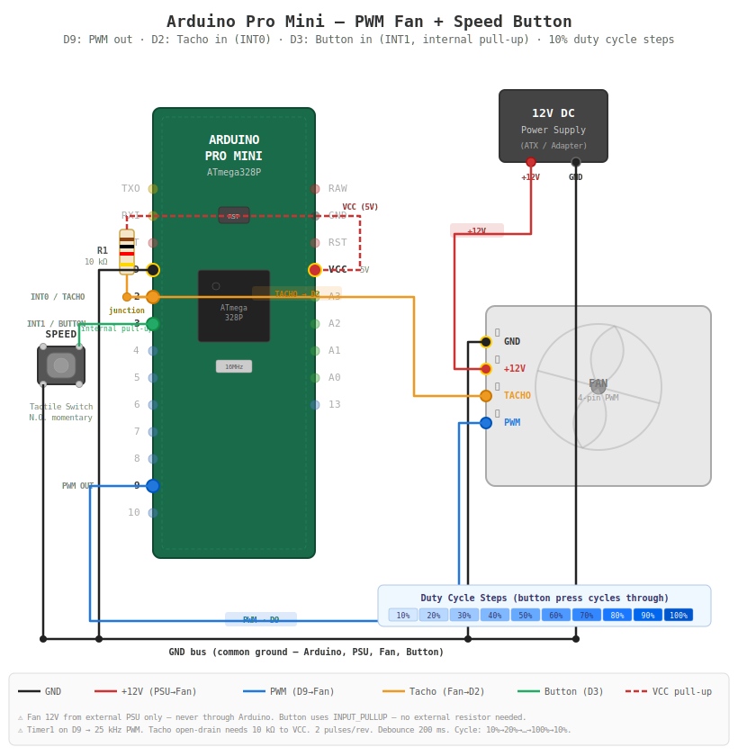

# pc-fan-control

## Version

V0.1

## Date
2026-02-16

------

## Table of Contents
1. [Purpose and Scope](#1-purpose-and-scope)
2. [System overview](#2-system-overview)
   - [2.1 General](#21-general)
   - [2.2 Wiring diagram](#22-wiring-diagram)
3. [Requirements](#3-requirements)
   - [3.1 Functional requirements](#31-functional-requirements)
   - [3.2 Non-Functional requirements](#32-non-functional-requirements)
4. [Build and Upload](#4-build-and-upload)
   - [4.1 Prerequisites](#41-prerequisites)
   - [4.2 Build firmware](#42-build-firmware)
   - [4.3 Upload to Arduino Pro Mini](#43-upload-to-arduino-pro-mini)
   - [4.4 Build for development machine (native)](#44-build-for-development-machine-native)
   - [4.5 Run unit tests](#45-run-unit-tests)

------

## 1. Purpose and Scope
This is a simple arduino based project to control the speed of a PWM based PC fan.

## 2. System overview
### 2.1. General
- Arduino Pro Mini 5 volts micro controller
- A PWM based PC fan. Mine is from an old MAC and has 4 wires.
- 12 volts power supply
- Button to change the speed of the fan in several steps (e.g. 10%, 20%, ..., 100%)
- Platform.io as development environment

### 2.2. Wiring diagram


# 3. Requirements

## 3.1 Functional requirements
**FR-0001**
The system shall start with a duty cycle of 50% when powered up.

**FR-0002**
Each time the button is pushed, the system shall increase the duty cycle by 10% and after reaching 100% start over with 10%.

## 3.2 Non-Functional requirements
**NFR-0001**
The system shall be buildable via PlatformIO CLI without requiring an IDE.

**NFR-0002**
The system shall be resilient to multiple button signals received within one time the user actually pushes the button. Multiple signals within the duration of 500 ms can be interpreted as one single button press.

# 4. Build and Upload

## 4.1 Prerequisites
- [PlatformIO CLI](https://docs.platformio.org/en/latest/core/installation/index.html) (`pip install platformio`)

## 4.2 Build firmware
```bash
pio run -e pro16MHzatmega328
```

## 4.3 Upload to Arduino Pro Mini
Connect the board via a USB-to-serial adapter, then:
```bash
pio run -t upload
```

## 4.4 Build for development machine (native)
Compile the native environment without uploading — useful for verifying the code builds on your development machine:
```bash
pio run -e native
```

## 4.5 Run unit tests
The core logic (duty cycle mapping, step/wrap, debounce) is unit-tested on the host machine using the PlatformIO native environment and the Unity test framework. This compiles and executes the tests locally:
```bash
pio test -e native
```
